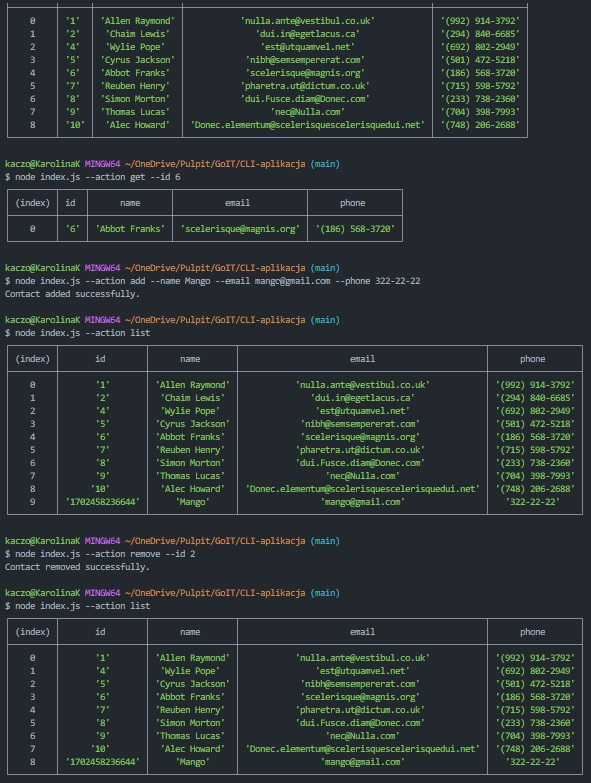
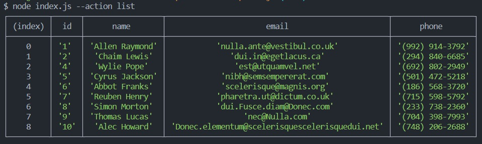
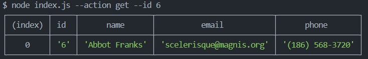
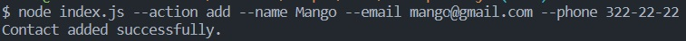
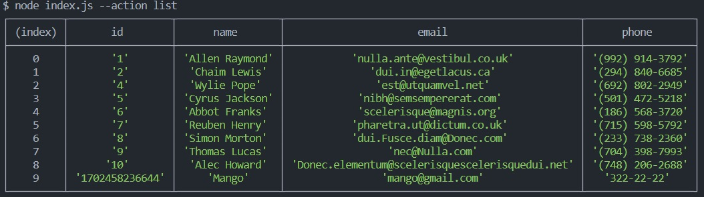
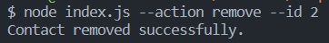
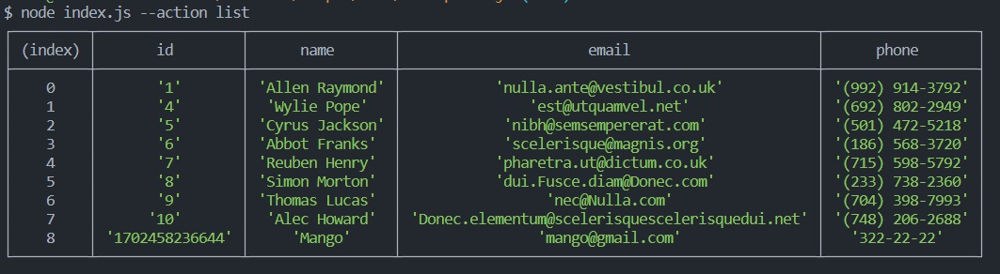
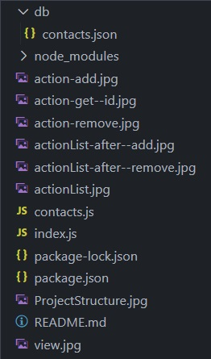

# CLI-App

---

A simple app to store contacts.

## Introduction

---

CLI console application (command-line interface). The application uses the commander module to parse command line arguments. User can add,
remove, filter by Id contacts and display a table with saved contacts.

## Technologies

---

- Java Script
- Node.js

## Starting up

---

### First install all required dependencies:

- npm install

### Basic comedy in the terminal

- node index.js --action list
  
- node index.js --action get --id 'enter the id you are looking for'
  
- node index.js --action add --name Mango --email mango@gmail.com --phone 322-22-22
  
  
- node index.js --action remove --id enter the id to be deleted
  
  

## Project Structure

---

## Author

---

- Karolina Kaczorowska
- e-mail: kaczorowska.karolina@gmail.com
- GitHub: https://github.com/KaczorowskaKarolina
- LinkedIn: https://www.linkedin.com/in/karolina-kaczorowska-33b337220/
